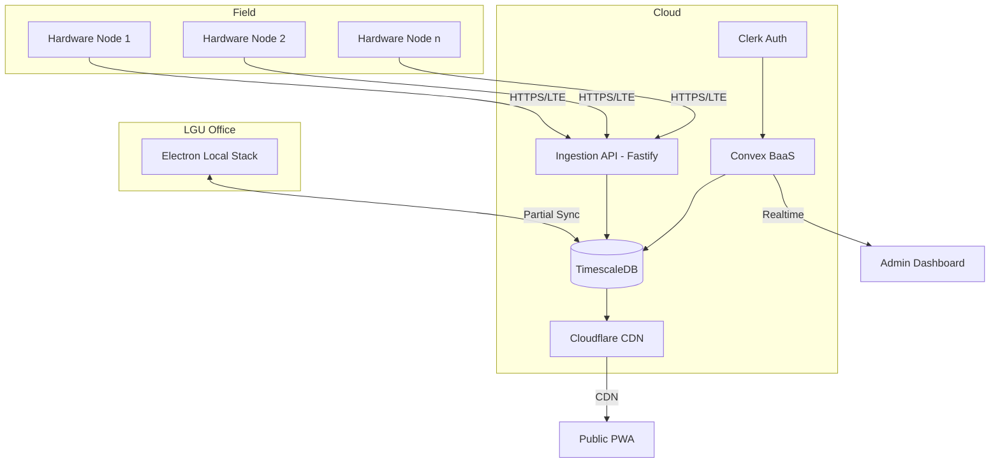
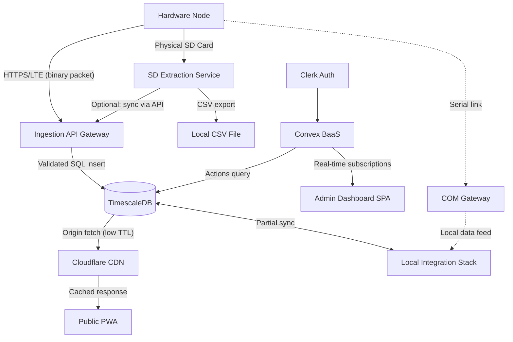

# Project Sipat Banwa: System Architecture

**Project Sipat Banwa** is a low-cost, community-focused Automatic Weather Station (AWS) system designed for Local Government Units (LGUs). The system prioritizes real-time monitoring of critical environmental metrics to assist in local decision-making and disaster preparedness.

For ease of access and public visibility, the project operates under the [panahon.live](https://panahon.live) domain.

## Project Scope
The current implementation focuses exclusively on **monitoring** (not forecasting). The measured parameters are:
- Temperature
- Humidity
- Precipitation (Rainfall)

---

## System Components

### 1. Hardware Node (ESP32)
The core sensing unit deployed in the field.
- **Microcontroller**: ESP32.
- **Connectivity**: Primary data transmission via **LTE** using compact binary packets sent to the Ingestion API.
- **Local Storage**: High-resolution (1s) logging to SD Card.
- **Sensing**: High-frequency sampling (1Hz) with adaptive transmission intervals.
- **Authentication**: Each node is provisioned with a **pre-shared secret key** at deployment time. Rather than transmitting the key directly, each packet is authenticated with an **HMAC-SHA256 signature** computed over the binary payload. The server recalculates the HMAC to verify both the sender identity and payload integrity, preventing key extraction and replay attacks.
- **OTA Firmware**: Nodes support dual-partition over-the-air (OTA) firmware updates over LTE. Updates are never downloaded automatically — they are triggered exclusively by an explicit admin command to avoid impacting the KB/month data budget.

### 2. Ingestion API Gateway
A lightweight HTTP service that sits between the hardware nodes and TimescaleDB.
- **Stack**: **Fastify (Node.js)** — chosen to keep the full stack in JavaScript and for native `Buffer` support for binary parsing.
- **Responsibilities**:
    - Receive binary `WeatherPacket` payloads from nodes over HTTPS.
    - Validate packet integrity (CRC check).
    - Authenticate the sending node by **verifying the HMAC-SHA256 signature** of the payload against the stored secret key — the raw key is never transmitted.
    - Deserialize the binary packet into structured data.
    - **Timestamp sanity check**: If an incoming timestamp predates the project's deployment year, the API treats it as a cold-boot epoch anomaly and applies **time reconciliation** using the node's logged `uptime_ms` (see *Clock Drift & Timestamp Integrity* below).
    - Write validated records to TimescaleDB via parameterized SQL inserts.
    - **Active cache invalidation**: When a node transitions into "event mode" (heavy rainfall), the API makes an outbound call to the **Cloudflare Cache Purge API** to immediately evict the stale edge cache for that LGU's public endpoint — passive `Cache-Control` headers alone are insufficient while a CDN TTL is active.
    - Rate-limit and log all incoming requests.
- **Deployment**: Runs alongside TimescaleDB on the same host/server.

### 3. Public Web Application ([panahon.live](https://panahon.live))
A public-facing portal for citizens to view weather data.
- **Type**: Progressive Web App (PWA).
- **Access**: No account login required, ensuring maximum accessibility.
- **Data Delivery**: Data is served via **Cloudflare** caches with a low Time-To-Live (TTL). This provides **near-real-time polling** — the client fetches periodically from Cloudflare, which refreshes from the origin on each TTL expiry. This is not a persistent real-time connection (WebSocket/SSE), but a pragmatic trade-off that shields the database from public traffic spikes.

### 4. Admin Dashboard ([dashboard.panahon.live](https://dashboard.panahon.live))
A dedicated management interface for LGU administrators.
- **Type**: Single Page Application (SPA).
- **Stack**: Built with **Convex** (backend-as-a-service) and **Clerk** (authentication).
- **Features**:
    - Node management and health monitoring.
    - Historical data visualization.
    - "Big Screen" view for Command Centers.
- **Data Architecture**: The Admin Dashboard operates across two backends:
    - **Convex** owns admin-domain state: node configuration, user preferences, alert rules, workspace settings, and real-time subscriptions.
    - **TimescaleDB** owns all historical sensor data. The dashboard accesses this via **Convex actions** that query TimescaleDB on the server side, keeping the database credentials secure and off the client.

### 5. TimescaleDB (Data Storage)
The primary time-series database.
- **Role**: Stores high-resolution historical data from all deployed nodes. This is the **single source of truth** for all sensor data.
- **Optimized for**: Efficient querying of time-series weather data, continuous aggregates, and long-term storage with automatic compression.
- **Replicated Node Metadata**: To avoid cross-database joins at query time, essential node metadata — `lgu_id`, `location_name`, `barangay`, `hardware_version`, and `node_label` — is **replicated as a relational table** (`nodes_meta`) inside TimescaleDB. This allows complex analytical queries (e.g., *"average rainfall today for all V2 nodes in Barangay San Isidro"*) to be executed entirely within a single SQL statement. The Convex backend is the write master for this metadata; changes are propagated to TimescaleDB via a Convex action.

### 6. SD Card Extraction Service
A localized utility for data recovery from field nodes.
- **Purpose**: Reads raw sensor logs from node SD cards and exports them to **CSV files** on the operator's computer.
- **Cloud Sync**: The operator can optionally choose to **sync the extracted data to TimescaleDB** via the Ingestion API, using the same idempotent upsert strategy to prevent duplicates.

---

## Data Ownership Map

| Data Domain | Owning System | Accessed By |
|---|---|---|
| Raw sensor readings (historical) | **TimescaleDB** | Admin Dashboard (via Convex actions), Public PWA (via Cloudflare cache) |
| Node configuration & metadata | **Convex** | Admin Dashboard |
| User accounts & auth | **Clerk** (via Convex) | Admin Dashboard |
| Alert rules & preferences | **Convex** | Admin Dashboard |
| Workspace / LGU settings | **Convex** | Admin Dashboard |
| Local offline data | **Local embedded DB** | Local Integration Stack |

---

## Future & Experimental: Local Integration Stack

For environments with limited or no internet connectivity, the system includes a planned **Local Integration Stack** — a single Electron application that bundles the admin dashboard UI with background services.

### Architecture

```
┌──────────────────────────────────────────────────────┐
│               Electron App (Local)                   │
│  ┌────────────────────────────────────────────────┐  │
│  │    Local Admin Dashboard (same webapp UI)      │  │
│  │    Reuses the SPA codebase from the cloud app  │  │
│  └────────────────────────────────────────────────┘  │
│  ┌────────────────────────────────────────────────┐  │
│  │          Background Services Daemon            │  │
│  │  • TimescaleDB Partial Sync Service            │  │
│  │  • SD Card Reader & CSV Export Service         │  │
│  │  • SD-to-Cloud Sync Service                    │  │
│  └────────────────────────────────────────────────┘  │
│  ┌────────────────────────────────────────────────┐  │
│  │       Local Embedded Database (SQLite)         │  │
│  └────────────────────────────────────────────────┘  │
└──────────────────────────────────────────────────────┘
```

### Services

| Service | Function |
|---------|----------|
| **TimescaleDB Partial Sync** | Downloads a configurable subset of cloud data (e.g., last 30 days for the user's LGU) to the local embedded DB for offline access. |
| **SD Card Reader & CSV Export** | Detects inserted SD cards, reads raw 1-second CSV logs, and exports formatted data to the operator's file system. |
| **SD-to-Cloud Sync** | Pushes SD card data to TimescaleDB via the Ingestion API using the idempotent upsert strategy. Queues uploads if offline and retries when connectivity returns. |

### COM-based Gateway Device (Optional Peripheral)
An ESP32-based peripheral that connects to the host computer via Serial (COM).
- **Function**: Allows a field node to send sensor data directly to the Electron app via a physical link, bypassing LTE entirely.
- **Use Case**: Indoor command centers or areas with no cellular coverage.

---

## Data Acquisition & Telemetry Strategy

Project Sipat Banwa employs a three-tier data strategy to balance scientific resolution with transmission efficiency.

### 1. High-Frequency Acquisition
Sensors are sampled at high frequency locally to preserve temporal resolution:
- **Temperature/Humidity**: 1 second
- **Precipitation**: Interrupt-based (tipping bucket)
- **Time Sync**: RTC synchronized via NTP periodically.

### 2. Local Raw Logging (SD Card)
All raw 1-second measurements are stored in CSV format on the SD card. This ensures a full-resolution "gold record" exists for research and debugging, regardless of connectivity.

Each CSV row includes **two time fields**:
- `rtc_timestamp` — the value from the hardware RTC (may be wrong after a cold boot with no NTP access).
- `uptime_ms` — the node's monotonic millisecond uptime counter since last boot, sourced from `millis()`. This is always correct regardless of RTC state.

This dual-timestamp scheme enables **post-hoc time reconciliation** during SD card ingestion: if `rtc_timestamp` is detected as impossible (e.g., year 1970), the true timestamp is back-calculated as `server_arrival_time - uptime_ms_at_arrival + uptime_ms_of_record`.

### 3. Compressed Telemetry (LTE)
To minimize power and data costs, the system uses **binary encoding** and **adaptive transmission**:

- **Aggregation**: Data is summarized (avg, min, max, accumulation) over the transmission interval.
- **Integer Scaling**: Values are converted to scaled integers (e.g., 29.4°C → 294) to avoid floating-point overhead.
- **Binary Structure**: A compact 19-byte `WeatherPacket` structure is used, reducing transmission size by up to 20x compared to JSON.
- **Adaptive Intervals**: Transmission frequency adjusts based on weather conditions and battery state:
    - **Event (Rain)**: ~10 seconds
    - **Active**: 1–2 minutes
    - **Stable/Night**: 5–15 minutes
- **Multi-Interval Packing**: Multiple weather summaries can be combined into a single transmission to further reduce connection overhead.
- **Reliability**:
    - **Data Integrity**: Packets include CRC checks, verified by the Ingestion API before database insertion.
    - **Persistence**: Retransmission attempts are made if the cellular link is unstable.
    - **Timekeeping**: Local RTC handles continuous operation, with periodic NTP sync via cellular/WiFi.

---

## Security Model

The system follows a tiered access model to balance openness with data integrity.

### Admin/Write Tier
- **Hardware nodes** authenticate to the Ingestion API via **HMAC-SHA256 message signing**. Each node holds a pre-shared secret key provisioned at deployment time. The key is **never sent over the wire** — instead, the node computes `HMAC-SHA256(secret, payload)` and includes the signature in the request header. The server recomputes the HMAC server-side to verify authenticity and payload integrity. This prevents both key extraction (even if USB/SD access is gained) and payload tampering. Secret keys can be rotated per-node from the Admin Dashboard.
- **LGU administrators** authenticate via **Clerk**-managed identity for the Admin Dashboard.

### Public/Read Tier
- Citizens access data via [panahon.live](https://panahon.live).
- To protect core infrastructure, the public webapp **never queries the database directly**. All data is served through **Cloudflare** caches, decoupling public traffic from the production DB.

### Multi-Tenancy & Data Isolation
- The system supports multiple LGUs via a **Workspaces** model.
- Each LGU operates within its own **separate schema** in TimescaleDB, ensuring strict data isolation at the database level.
- In Convex, workspaces are first-class entities — each workspace has its own set of accounts, node configurations, and alert rules. Clerk organizations map to workspaces for access control.
- Administrators can only view and manage nodes within their own workspace.

---

## Initial API Contract

### Ingestion API (`/api/v1/`)

| Method | Endpoint | Auth | Description |
|--------|----------|------|-------------|
| `POST` | `/api/v1/ingest` | API Key (header) | Receive binary `WeatherPacket` from a node. Validates CRC, deserializes, writes to TimescaleDB. |
| `POST` | `/api/v1/ingest/batch` | API Key (header) | Receive multiple packed `WeatherPacket` summaries in a single payload. |
| `GET`  | `/api/v1/health` | None | Health check endpoint for monitoring. |

### Public Read API (`/api/v1/public/`)

| Method | Endpoint | Auth | Description |
|--------|----------|------|-------------|
| `GET`  | `/api/v1/public/latest/{node_id}` | None | Latest reading for a node. Served via Cloudflare cache. |
| `GET`  | `/api/v1/public/history/{node_id}` | None | Historical data with time-range query params. Cached with longer TTL. |

### Admin (via Convex)
- All admin operations (node CRUD, alert rules, workspace management) are handled through **Convex queries, mutations, and actions**.
- TimescaleDB historical queries are executed via **Convex actions** that connect server-side.

---

## Scalability & Extensibility

Project Sipat Banwa is designed to scale across multiple dimensions:

- **Multi-tenancy**: The database uses separate schemas per LGU workspace, with Convex workspaces providing application-level isolation. This ensures each LGU manages only its own nodes.
- **Sensor Extensibility**: The system uses a generic data ingestion format. Adding new sensors (e.g., wind speed, water level, soil moisture) requires only a hardware update and a minor configuration change in the dashboard, without a core system refactor.
- **Node Density**: The combination of TimescaleDB's time-series optimization and Cloudflare's edge caching is designed to support scaling to hundreds of nodes and thousands of concurrent public users. (This is a design goal — production load testing will validate specific thresholds.)

---

## Synchronization & Integrity (Sync Strategy)

To prevent "split-brain" issues (where local and cloud data conflict), the system uses an **Idempotent Upsert Strategy**:

- **Unique Identity**: Every data point is tagged with a unique composite key: `node_id` + `timestamp` + `sensor_type`.
- **Deduplication**: When the Local Stack or Extraction Service pushes data to the cloud, the database performs an **upsert** (update or insert). If a record for that specific timestamp already exists, it is ignored or updated, preventing duplicate entries.
- **Conflict Resolution**: The cloud (TimescaleDB) is treated as the official source of truth. Offline data is integrated into the cloud record chronologically.

### Cold-Boot Epoch Reconciliation
If a node loses power and reboots during an LTE outage, its RTC may reset to January 1, 1970 (or another impossible pre-deployment date) because it cannot reach an NTP server. Without correction, the idempotent upsert would silently write gigabytes of high-resolution storm data into the year 1970, rendering it completely unusable.

**The fix is a two-part strategy:**
1. **On the node (SD card)**: Every CSV row logs both `rtc_timestamp` and `uptime_ms` (monotonic `millis()` counter). The uptime counter is always accurate because it is not sourced from the RTC.
2. **On the Ingestion API / Extraction Service**: Before inserting any record, the system checks whether `rtc_timestamp` predates the deployment year. If so, it applies **time reconciliation**:
   ```
   true_timestamp = server_unix_time_at_arrival - (node_uptime_ms_at_arrival - row_uptime_ms) / 1000
   ```
   The corrected timestamp is written to the database alongside an `is_time_reconciled = true` flag for auditability.

---

## Failure Modes & Mitigations

| Failure | Impact | Mitigation |
|---------|--------|------------|
| **LTE link down** | Node cannot transmit data to cloud. | Data continues logging to SD card at full resolution. Adaptive intervals reduce retry overhead. SD-to-Cloud Sync recovers data when connectivity returns. |
| **TimescaleDB down** | Admin Dashboard and Public PWA lose data source. | Cloudflare serves stale-but-available cached data to the public. Ingestion API queues incoming packets with a short retry buffer. Automated backups enable recovery. Local Stack provides offline admin access. |
| **Cloudflare unreachable** | Public PWA cannot load data. | PWA service worker serves last-cached data. Fallback: direct API endpoint (rate-limited). |
| **SD card corruption** | Loss of high-resolution local record. | Use CRC checksums per CSV record. Implement write journaling (flush + fsync). Detect and alert on read errors during extraction. Redundancy: if LTE was active, aggregated data already exists in TimescaleDB. |
| **Clock drift (RTC)** | Timestamp collisions → silent data overwrite via upsert. | Append a **monotonic sequence number** to each record alongside the timestamp. Server-side drift detection: if incoming timestamps deviate significantly from server time, flag the node for NTP re-sync and log a warning. |
| **Cold boot without NTP (1970 epoch)** | RTC resets to 1970; storm records ingested with wrong timestamps become permanently unusable. | Every SD card row logs both `rtc_timestamp` and `uptime_ms`. The Ingestion API / Extraction Service detects impossible timestamps and applies post-hoc time reconciliation using the uptime counter and server arrival time. Records are flagged `is_time_reconciled = true`. |
| **LTE data plan exhausted** | Node goes silent for remainder of billing cycle. | Calculate a monthly data budget per node. Implement a hard minimum transmission interval floor. Dashboard alerts when estimated usage exceeds 80% of plan. |

---

## Observability & Metrics Strategy

### Node Health Monitoring
- Each node includes a **heartbeat** in its telemetry — if no data is received within 2× the expected interval, the system flags the node as potentially offline.
- Battery voltage and signal strength (RSSI) are included in telemetry packets for proactive maintenance alerts.
- The Admin Dashboard shows node status (online/degraded/offline) with last-seen timestamps.

### Infrastructure Metrics
- **Ingestion API**: Request rate, error rate, latency percentiles (p50/p95/p99), active connections.
- **TimescaleDB**: Query latency, disk usage, chunk compression ratio, connection pool utilization.
- **Cloudflare**: Cache hit ratio, origin request rate, bandwidth.

### Alerting
- **Node silent** > 2× expected interval → alert to LGU admin.
- **Ingestion API error rate** > 5% → alert to system operator.
- **DB disk usage** > 80% → alert to system operator.
- **Multiple nodes report clock drift** → alert for NTP infrastructure check.

### Logging
- Ingestion API logs all requests (node ID, timestamp, packet size, validation result) in structured JSON format for debugging and audit trails.
- Failed authentication attempts are logged separately for security monitoring.

---

## Deployment Topology (Placeholder)

> **Note**: This section will be updated with specific infrastructure details as the production deployment is finalized.



---

## Risk Mitigations for Known Challenges

### Clock Drift & Timestamp Integrity
- **Monotonic sequence numbers**: Each node maintains a per-boot, auto-incrementing sequence counter appended to each record. Even if timestamps collide, the sequence number differentiates records.
- **Server-side drift detection**: The Ingestion API compares incoming timestamps against server time. Deviations beyond a configurable threshold (e.g., ±30 seconds) trigger:
    - A warning flag on the node in the Admin Dashboard.
    - A forced NTP re-sync command sent to the node on next heartbeat.
    - Logging of the drift magnitude for post-hoc correction.
- **Cold-boot epoch detection & reconciliation**: If an incoming or SD-extracted timestamp predates the project's deployment year, the system treats it as an RTC cold-boot anomaly. It uses the `uptime_ms` value logged alongside each record to back-calculate the true timestamp relative to the server's arrival time. This preserves critical storm data that would otherwise be permanently corrupted. Records corrected this way are tagged with `is_time_reconciled = true` for full auditability.

### SD Card Reliability
- **Write journaling**: Use a write-ahead pattern — buffer in RAM, write to a temp file, `fsync`, then atomically rename. This prevents partial writes on power loss.
- **Per-record CRC**: Each CSV row includes a CRC-8 checksum. The Extraction Service validates each row on read and skips corrupted records with a warning.
- **Wear monitoring**: Track cumulative write count in EEPROM. Alert when approaching manufacturer-rated write cycle limits.
- **Card-grade recommendation**: Specify industrial-grade SD cards (SLC/pSLC NAND) rated for extended temperature ranges and higher endurance in the hardware BOM.

### LTE Cost Management
- **Data budget**: Calculate estimated monthly data usage per node at each adaptive interval tier. Example estimate:
    - Stable mode (15 min intervals): ~19 bytes × 4/hr × 24hr × 30 days ≈ **55 KB/month**
    - Active mode (2 min intervals): ~19 bytes × 30/hr × 24hr × 30 days ≈ **410 KB/month**
    - Event mode (10s intervals): ~19 bytes × 360/hr × 24hr × 30 days ≈ **4.9 MB/month**
- **Hard floor**: Implement a minimum transmission interval that cannot be exceeded regardless of conditions, preventing runaway data usage.
- **Usage tracking**: Dashboard displays estimated vs. actual data usage per node with alerts at 80% of plan capacity.

### TimescaleDB as Single Point of Failure
- **Automated backups**: Daily `pg_dump` with retention policy. Store offsite (object storage).
- **The Local Stack as a resilience layer**: Because the Local Stack maintains a partial sync of TimescaleDB, LGU admins retain read access to recent data even if the cloud DB is completely down.
- **Graceful degradation**: If the DB is unreachable, the Ingestion API buffers packets in memory (bounded queue) and retries. The Public PWA serves Cloudflare's last-known-good cache.

### Cache Staleness During Weather Emergencies
- **Active Cloudflare Cache Purge**: When a node transitions into event mode (heavy rainfall detected), the Ingestion API makes an outbound HTTP `POST` request to the **Cloudflare Cache Purge API** (`/client/v4/zones/{zone_id}/purge_cache`) to immediately evict the edge cache for that specific LGU's public endpoints. Relying on passive `Cache-Control: no-cache` response headers alone is insufficient — Cloudflare (and any CDN) only re-validates the origin after the current TTL expires, meaning the origin API's headers are invisible until that moment.
- **Emergency banner**: The Admin Dashboard can trigger an emergency status that the Public PWA checks independently of weather data, ensuring citizens see warnings even if data is cached.

### Bidirectional Sync Complexity
- **Simplify to unidirectional for sensor data**: Sensor readings flow **only** from local → cloud (never cloud → local overwrites local). The cloud is append-only for sensor data.
- **Last-write-wins for admin state**: Node configuration and preferences use Convex's built-in real-time sync. Offline edits in the Local Stack queue mutations that are applied in order when connectivity resumes.
- **No CRDTs needed**: By constraining the sync model (sensor data is immutable once written, admin state uses last-write-wins), we avoid the complexity of conflict-free replicated data types.

---

### OTA Firmware Updates
Deploying firmware bug fixes to 50+ field nodes by physically connecting a laptop to each pole is logistically infeasible and defeats the low-cost goal of the project. However, naively downloading 1–2 MB `.bin` files over LTE on every update would violate the strict KB/month data budget.

**Dual-partition OTA system:**
- The ESP32 firmware uses Arduino OTA / `esp_ota` with two application partitions (`ota_0` / `ota_1`). After a successful download, the bootloader switches to the new partition atomically. A failed update leaves the running partition intact (automatic rollback).
- During each routine heartbeat ping, the node includes its current `firmware_version` in the telemetry metadata. The Ingestion API responds with an `update_available: true` flag if a newer version is staged.
- **The download itself is never automatic.** An LGU admin must issue an explicit **OTA push command** from the Admin Dashboard, targeting one or many nodes by ID, barangay, or hardware generation. This gives operators full control and prevents unplanned LTE consumption during active weather events.
- Large `.bin` files are hosted on object storage (e.g., Cloudflare R2) and delivered as pre-signed URLs with short expiry to prevent unauthorized downloads.

---

## Data Flow Diagram


