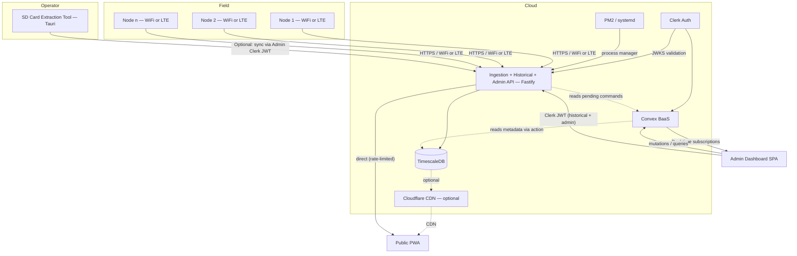
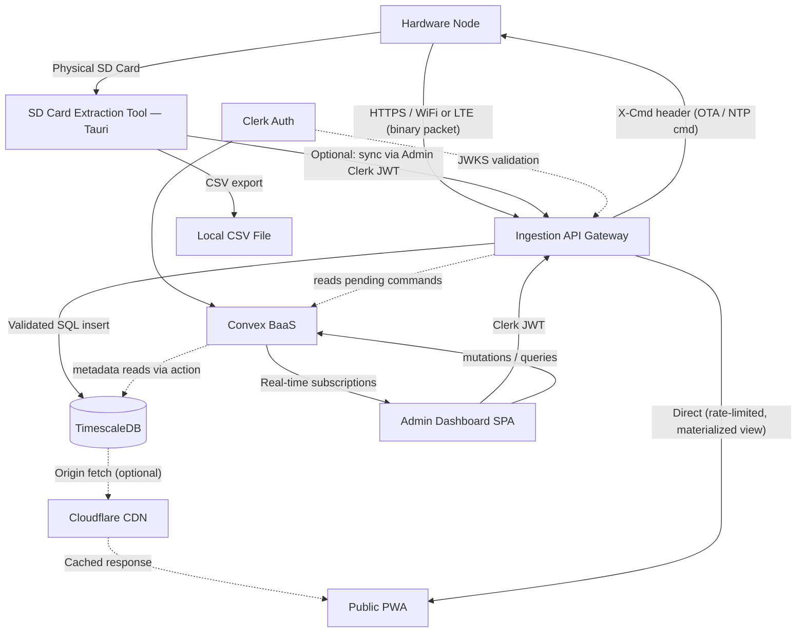

# Project Sipat Banwa: System Architecture

**Project Sipat Banwa** is a low-cost, community-focused Automatic Weather Station (AWS) system designed for Local Government Units (LGUs). The system prioritizes real-time monitoring of critical environmental metrics to assist in local decision-making and disaster preparedness.

For ease of access and public visibility, the project operates under the [panahon.live](https://panahon.live) domain.

## Project Scope
The current implementation focuses exclusively on **monitoring** (not forecasting). The measured parameters are:
- Temperature
- Humidity
- Precipitation (Rainfall)

---

## System Components

### 1. Hardware Node (ESP32)
The core sensing unit deployed in the field.
- **Microcontroller**: ESP32.
- **Connectivity**: Primary data transmission via **LTE**. The node attempts **WiFi first** (SSID/password stored in flash at provisioning time) and falls back to LTE if WiFi is unavailable, reducing cellular data costs when a node is deployed within range of a network (e.g., an LGU office or community center). When WiFi is the active link, the LTE modem remains in deep sleep. Transmission intervals are unchanged whether the active link is WiFi or LTE — intervals are kept consistent for predictable data resolution, not solely as a power-saving measure.
- **Local Storage**: High-resolution (1s) logging to SD Card.
- **Sensing**: High-frequency sampling (1Hz) with adaptive transmission intervals.
- **Authentication**: Each node is provisioned with a **pre-shared bearer API key** at deployment time. The key is sent in the `X-Node-Key` request header on every transmission. **The API key is the node identifier** — the server looks up the node record from the key alone (`api_key → node_id`). No separate node ID header is required or sent.
- **Packet Versioning**: The first byte of every binary packet is a **version byte**. The Ingestion API reads the version byte first, looks up the expected struct size for that version from a dispatch table, and validates the buffer length against that version-specific size. Unknown version bytes are rejected with `400` before any further parsing.
- **OTA Firmware**: Nodes support dual-partition over-the-air (OTA) firmware updates. Updates are triggered by an explicit admin command targeting a specific node by ID — never downloaded automatically — to avoid impacting the KB/month data budget.
- **NTP Synchronization**: On boot and every 6 hours, the node synchronizes its RTC against `pool.ntp.org`. **NTP sync is piggybacked onto the next scheduled transmission window** after the sync interval expires. No dedicated NTP-only modem wake is issued. In Power Saving mode (30-minute TX intervals), NTP sync may be delayed by up to 30 minutes after the interval expires — this is accepted. If NTP is unreachable, the node falls back to the last-known-good RTC value and logs the failed sync attempt.
- **On-board command handling**: After each successful transmission, the node reads the `X-Cmd` response header for pending management commands (OTA push URL, forced NTP re-sync). Normal responses return no `X-Cmd` header.
- **Response to rejection (400)**: If the Ingestion API rejects a packet with `400`, the node retries once after a 30-second delay. If the second attempt also returns `400`, the node logs the fault event to the SD card (with rejected value and timestamp) and discards the packet. This guards against transient server-side misconfigurations without infinite retry.
- **Critical Shutdown**: When battery voltage drops below a critical threshold (below the Power Saving threshold), the node flushes all SD card write buffers, closes open files, transmits a final `SHUTDOWN` system health packet, and enters indefinite deep sleep. This prevents SD card corruption on power exhaustion.

### 2. Ingestion API Gateway
A lightweight HTTP service that sits between the hardware nodes and TimescaleDB.
- **Stack**: **Fastify (Node.js)** — chosen to keep the full stack in JavaScript and for native `Buffer` support for binary parsing.
- **Responsibilities**:
    - Receive binary `WeatherPacket` payloads from nodes over HTTPS.
    - **Versioned length validation**: The API reads the version byte first, looks up the expected struct size for that version from a dispatch table, then validates the raw buffer length against the version-specific size. Unknown versions are rejected with `400` before parsing begins. This guards against buffer overflow attacks while supporting multiple packet format versions.
    - **Authenticate** the sending node by looking up the `X-Node-Key` bearer API key to resolve `api_key → node_id`. The key is the identifier — no separate header required. Authentication happens before parsing the packet body.
    - **CRC check**: Validate packet integrity after authentication.
    - Deserialize the binary packet into structured data, explicitly enforcing `Little-Endian` functions to match the ESP32 architecture.
    - **Timestamp sanity check**: If an incoming timestamp predates the project's deployment year, the API treats it as a cold-boot epoch anomaly and applies **time reconciliation** using the node's logged `uptime_ms` (see *Clock Drift & Timestamp Integrity* below).
    - **Range validation**: Before writing to the database, each sensor value is checked against configurable min/max thresholds per sensor type. Readings outside the valid range are rejected with a `400` response and a sensor fault event is logged. Thresholds are configurable per node in the Admin Dashboard.
    - Write validated records to TimescaleDB via parameterized SQL inserts.
    - **Command/response protocol**: After each successful ingest write, the API checks Convex for any `pendingCommands` document for the sending node. If a pending command exists, it is delivered in the HTTP response via an `X-Cmd` header: `X-Cmd: ota=<firmware_url>` for OTA push, or `X-Cmd: ntp_sync` for forced NTP re-sync. Normal responses return no `X-Cmd` header. This avoids the need for a JSON response parser on the ESP32.
    - **Active cache invalidation** (when Cloudflare is in use): When a node transitions into event mode (heavy rainfall), the API calls the Cloudflare Cache Purge API to immediately evict stale edge cache for that LGU's public endpoint. Only active when Cloudflare is deployed.
    - Rate-limit and log all incoming requests.
    - **In-memory packet buffer**: When TimescaleDB is temporarily unreachable, the API queues incoming packets in a bounded in-memory queue (sized to hold approximately 30 minutes of data at the maximum transmission rate). On overflow, the oldest packets are dropped first and a counter is incremented. Queue depth is exposed via the `/api/v1/health` endpoint. Lost packets are recoverable from the node's SD card.
- **Historical Data endpoint**: The Ingestion API serves a read-only historical data endpoint (`/api/v1/historical/`) authenticated via **Clerk JWT**. This allows the Admin Dashboard to query TimescaleDB directly without routing through Convex, keeping Convex focused on real-time admin state.
- **Admin endpoint**: The Ingestion API also exposes an admin endpoint (`/api/v1/admin/`) authenticated via **Clerk JWT** for node provisioning and metadata management. The Ingestion API accepts either auth method on the ingest endpoint: a bearer API key (live node transmission or legacy SD sync) or a Clerk JWT (operator-initiated SD card sync via the Extraction Tool).
- **Process management**: The API process is managed by **PM2** (or systemd in a bare-metal deployment) with a restart-on-crash policy. This makes the API process restart within seconds of a crash, keeping the failure window negligible by design.
- **Deployment**: Runs alongside TimescaleDB on the same host/server.

### 3. Public Web Application ([panahon.live](https://panahon.live))
A public-facing portal for citizens to view weather data.
- **Type**: Progressive Web App (PWA).
- **Access**: No account login required, ensuring maximum accessibility.
- **Offline strategy**: The PWA service worker caches the **last 24 hours of readings per node** plus the application shell. Citizens can view the trend leading up to an outage during connectivity loss. Cache entries are updated on each successful API response with a stale-while-revalidate strategy.
- **Data Delivery**: In production, data is served via **Cloudflare** caches with a low Time-To-Live (TTL), shielding the database from public traffic spikes. Cloudflare is an **optional optimization layer**, not a required component — the PWA can query the Ingestion API's public endpoints directly (with rate limiting applied at the API) when Cloudflare is not in use. All API responses include `Cache-Control` headers for CDN compatibility.

### 4. Admin Dashboard ([dashboard.panahon.live](https://dashboard.panahon.live))
A dedicated management interface for LGU administrators.
- **Type**: Single Page Application (SPA).
- **Stack**: Built with **Convex** (backend-as-a-service) and **Clerk** (authentication).
- **Features**:
    - Node management and health monitoring.
    - Node provisioning (register new nodes, retrieve generated API keys).
    - Historical data visualization.
    - **"Big Screen" view**: An auth-required full-screen display mode. An admin logs in, enters full-screen mode, and the dashboard switches to a display layout showing current conditions for all nodes in the workspace. No separate URL or public endpoint is required — the existing admin session powers it. Intended for command center display monitors.
    - Range threshold configuration per node.
    - OTA firmware push (per node, admin-initiated).
- **Data Architecture**: The Admin Dashboard operates across two backends with a clear division of responsibility:
    - **Convex** owns real-time admin-domain state: alert rules, user preferences, workspace settings, and pending node commands (including OTA). Real-time subscriptions for these domains use Convex's native reactivity.
    - **TimescaleDB** owns all historical sensor data and node metadata. The dashboard queries and writes node metadata **directly via a Clerk JWT** to the **Historical/Admin API** endpoint on the Fastify server. Convex is not in the historical data path and does not maintain its own copy of metadata.

### 5. TimescaleDB (Data Storage)
The primary time-series database and the **single source of truth** for all sensor and node data.
- **Role**: Stores high-resolution historical data from all deployed nodes.
- **Optimized for**: Efficient querying of time-series weather data, continuous aggregates, and long-term storage with automatic compression.
- **Node Metadata**: TimescaleDB is the **write master** for node metadata (`lgu_id`, `location_name`, `barangay`, `hardware_version`, `node_label`). Writes go through the Fastify Admin API (Clerk JWT). This allows analytical queries to execute entirely within a single SQL statement. Convex reads metadata via an action when it needs it for admin-domain operations — it does not maintain its own copy.
- **Multi-tenancy**: Workspace isolation is implemented via a `workspace_id` column on all relevant tables, enforced by **Row-Level Security (RLS)** policies. This replaces the previous schema-per-LGU approach, simplifying migrations and enabling cross-workspace queries without dynamic SQL.
- **Public read access**: Public endpoints use a dedicated database role that only has access to a pre-computed **materialized view** of public-facing data (latest reading per node, no workspace column exposed). RLS does not apply to this role — the view enforces scope at the schema level. This eliminates the need to set RLS context on unauthenticated queries.

### 6. SD Card Extraction Tool
A standalone desktop utility for data recovery from field nodes.
- **Purpose**: Reads raw sensor logs from node SD cards and exports them to **CSV files** on the operator's computer.
- **Technology**: Built with **Tauri** (Rust + OS WebView — WebView2 on Windows, WebKit on macOS/Linux). Ships as a small native binary (~3–10 MB) using the OS's built-in webview. No Chromium bundled. The frontend is standard HTML/JS, compatible with the existing web stack.
- **Cloud Sync**: The operator can optionally sync extracted data to TimescaleDB via the Ingestion API, using the same idempotent upsert strategy to prevent duplicates. SD sync authenticates using an **admin Clerk JWT** — this is an admin-authenticated operation, not a node operation. The Ingestion API accepts either a node bearer key (live node transmission) or a Clerk JWT (operator SD sync) on the ingest endpoint.

---

## Data Ownership Map

| Data Domain | Owning System | Write Path | Accessed By |
|---|---|---|---|
| Raw sensor readings (historical) | **TimescaleDB** | Fastify Ingestion API (node bearer key) | Admin Dashboard (Clerk JWT → Historical API), Public PWA (materialized view via CDN or direct API) |
| Node configuration & metadata | **TimescaleDB** (write master) | Fastify Admin API (Clerk JWT) | Admin Dashboard (direct Clerk JWT queries), Convex (action reads when needed) |
| User accounts & auth | **Clerk** (via Convex) | Clerk Auth service | Admin Dashboard |
| Alert rules & preferences | **Convex** | Convex mutations | Admin Dashboard |
| Workspace / LGU settings | **Convex** | Convex mutations | Admin Dashboard |
| Pending node commands (OTA, NTP) | **Convex** | Convex mutations (admin-triggered) | Fastify Ingestion API (reads on heartbeat via Convex action) |

---

## Data Acquisition & Telemetry Strategy

Project Sipat Banwa employs a three-tier adaptive data strategy to balance scientific resolution, system observability, and transmission efficiency. The architecture shifts between three operational modes based on environmental events and battery state.

### 1. Dual-Payload Architecture
To decouple high-frequency weather events from slower-moving hardware metrics, the node transmits two distinct packet types. Both types begin with a **version byte** as the first field.
- **Weather Payload**: Contains block-averaged environmental data (Temperature, Humidity, Precipitation accumulation, Min/Max metrics). **The Weather Payload also serves as the liveness signal** — if no weather reading is received within 2× the expected transmission interval for the current mode, the node is flagged as potentially offline.
- **System Health Payload**: Contains critical telemetry to monitor fleet status (Battery Voltage, Solar Charge Status, Cellular RSSI, Free Heap Memory, Uptime, and SD Card Free Space).

### 2. Adaptive Operational Modes
To minimize LTE modem wake times (the primary battery drain), the system adjusts its sampling and transmission block-average cadence dynamically:

#### Mode 1: High Alert (Active Rain / Emergency)
*Triggered by rainfall interrupt only.*
- **Weather Sampling**: Sample every **1 second**, block-averaged into **10-second** intervals.
- **SD Card Log**: Writes the 10-second block average to the SD card.
- **Cloud Transmission**: Sends to the DB **every 1 minute** (payload includes six 10s averages).
- **System Health Rate**: Transmitted **every 5 minutes** to closely track rapid battery drain during a storm.
- **Offline detection threshold**: Flag node if no weather reading received within **2 minutes**.

#### Mode 2: Nominal (Standard Operation)
*Standard, good weather conditions with healthy power.*
- **Weather Sampling**: Sample every **1 second**, block-averaged into **1-minute** intervals.
- **SD Card Log**: Writes the 1-minute block average to the SD card.
- **Cloud Transmission**: Sends to the DB **every 5 minutes** (payload includes five 1m averages).
- **System Health Rate**: Transmitted **every 5 minutes**, bundled with the weather payload for convenience.
- **Offline detection threshold**: Flag node if no weather reading received within **10 minutes**.

#### Mode 3: Power Saving (Low Battery / Solar Failure)
*Triggered when battery voltage drops below a configured threshold.*
- **Weather Sampling**: Sample every **10 seconds**, block-averaged into **1-minute** intervals.
- **SD Card Log**: Writes the 1-minute block average to the SD card.
- **Cloud Transmission**: Sends to the DB **every 30 minutes** (payload includes six 5m aggregated averages).
- **System Health Rate**: Transmitted **every 30 minutes**, bundled with the weather payload.
- **Offline detection threshold**: Flag node if no weather reading received within **60 minutes**.

#### Critical Shutdown (Battery Exhaustion)
*Triggered when battery voltage drops below the Power Saving threshold.*
- Flush all SD card write buffers and close open files.
- Transmit a final `SHUTDOWN` system health packet.
- Enter indefinite deep sleep.

#### Mode Transition Hysteresis
To prevent rapid oscillation between modes during intermittent rain, mode **downgrade** requires a quiet window. A node exits High Alert when fewer than **2 rainfall tips** occur in the last **5 minutes**. Both the tip count (N) and the window (M) are configurable per node in the Admin Dashboard.

### 3. Local Raw Logging & Time Synchronization (SD Card)
While data is aggregated for LTE transmission, the SD card maintains a localized record. Each CSV row includes **two time fields**:
- `rtc_timestamp` — the value from the hardware RTC (may be wrong after a cold boot with no NTP access).
- `uptime_ms` — the node's monotonic millisecond uptime counter since last boot, sourced from `millis()`. This is always correct regardless of RTC state.

Each CSV row also includes a **CRC-8 checksum** for integrity validation during extraction. SD card writes use a **periodic fsync** strategy — buffers are flushed at a regular interval — rather than atomic file renaming, which is sufficient for a system with graceful shutdown handling.

This dual-timestamp scheme enables **post-hoc time reconciliation** during SD card ingestion: if `rtc_timestamp` is detected as impossible (e.g., year 1970), the true timestamp is safely back-calculated using the uptime counter.

### 4. Compressed Telemetry (LTE)
To minimize data costs, the system uses **binary encoding**:
- **Versioning**: The first byte of every packet is a version identifier, enabling the Ingestion API to dispatch to the correct parser.
- **Integer Scaling**: Values are converted to scaled integers (e.g., 29.4°C → 294) to avoid floating-point overhead.
- **Binary Structure**: A compact binary struct reduces transmission size by up to 20x compared to JSON. Data integrity is maintained via CRC-8 checksums.
- **Reliability & Timekeeping**: Local RTC handles continuous operation with periodic NTP syncing (piggybacked on transmission windows). Retransmission attempts are made if the cellular link is unstable.

---

## Security Model

The system follows a tiered access model to balance openness with data integrity.

### Node Authentication (Write Tier)
Hardware nodes authenticate to the Ingestion API using a **pre-shared bearer API key** provisioned at deployment time. The key is sent in the `X-Node-Key` header on every HTTPS request. **The key is the node identifier** — the server resolves `api_key → node_id` from its lookup table before parsing the packet body. Keys can be rotated per-node from the Admin Dashboard.

This approach prioritizes implementation simplicity. The CRC-8 checksum in the binary packet provides protection against accidental payload corruption. Intentional in-transit payload tampering is mitigated by the HTTPS transport layer (TLS encryption).

**TLS trade-off**: TLS provides encryption, but the ESP32 firmware does not embed a root CA bundle — server identity is not verified at the application layer. This is an accepted trade-off for a thesis deployment on a controlled network. It is noted as a hardening item before any production expansion: adding a root CA bundle to the firmware would require an OTA update.

### Admin Authentication
LGU administrators authenticate via **Clerk**-managed identity. The Clerk-issued JWT is used by the Admin Dashboard to access both Convex (for real-time admin state) and the Historical/Admin API on the Fastify server (for TimescaleDB queries and node management operations).

### Public / Read Tier
Citizens access data via [panahon.live](https://panahon.live). The public webapp queries only the public read endpoints of the Ingestion API, which are unauthenticated and rate-limited. Public queries execute against a **materialized view** in TimescaleDB via a dedicated read-only database role — the view exposes only public-facing fields (no `workspace_id`), and RLS is not required for this role. Cloudflare CDN caching is an optional optimization that can be layered on top without application changes.

### Multi-Tenancy & Data Isolation
- The system supports multiple LGUs via a **Workspaces** model.
- Workspace isolation is enforced at the database level using a `workspace_id` column and **Row-Level Security (RLS)** policies in TimescaleDB. This ensures each LGU sees only its own data in all authenticated queries.
- In Convex, workspaces are first-class entities — each workspace has its own set of accounts, node configurations, and alert rules. Clerk organizations map to workspaces for access control.
- Administrators can only view and manage nodes within their own workspace.

---

## Initial API Contract

### Ingestion API (`/api/v1/`)

| Method | Endpoint | Auth | Description |
|--------|----------|------|-------------|
| `POST` | `/api/v1/ingest` | Bearer API Key (`X-Node-Key`) or Clerk JWT | Receive binary `WeatherPacket` from a node. Reads version byte, dispatches length validation per version, validates CRC, range-checks values, writes to TimescaleDB. Response includes `X-Cmd` header if a pending command exists for the node. Accepts Clerk JWT when called by the Extraction Tool for SD card sync. |
| `GET`  | `/api/v1/health` | None | Health check endpoint. Includes queue depth of the in-memory packet buffer. |

> **Note**: The batch ingest endpoint (`/api/v1/ingest/batch`) is **not in scope** for the current implementation. SD card recovery sync is handled by the Extraction Tool's own loop of single-packet upserts via the idempotent ingest endpoint.

### Public Read API (`/api/v1/public/`)

| Method | Endpoint | Auth | Description |
|--------|----------|------|-------------|
| `GET`  | `/api/v1/public/latest/{node_id}` | None | Latest reading from the public materialized view. Rate-limited. Compatible with Cloudflare CDN caching via `Cache-Control` headers. |
| `GET`  | `/api/v1/public/history/{node_id}` | None | Recent historical data (from materialized view) with time-range query params. |

### Historical Data API (`/api/v1/historical/`)

| Method | Endpoint | Auth | Description |
|--------|----------|------|-------------|
| `GET`  | `/api/v1/historical/{node_id}` | Clerk JWT | Full-resolution historical queries for the Admin Dashboard. Validates the Clerk-issued JWT via Clerk's JWKS endpoint. |
| `GET`  | `/api/v1/historical/aggregate` | Clerk JWT | Aggregated queries across nodes within a workspace. Workspace isolation enforced via RLS. |

### Admin API (`/api/v1/admin/`)

| Method | Endpoint | Auth | Description |
|--------|----------|------|-------------|
| `POST` | `/api/v1/admin/nodes` | Clerk JWT | Provision a new node. Creates the node record in TimescaleDB, generates and returns the bearer API key. Admin enters this key into node firmware before field deployment. |
| `GET`  | `/api/v1/admin/nodes/{node_id}` | Clerk JWT | Retrieve node metadata. |
| `PUT`  | `/api/v1/admin/nodes/{node_id}` | Clerk JWT | Update node metadata (location, label, thresholds). |

### Command/Response Protocol

Management commands are delivered to nodes via HTTP response headers on the `POST /api/v1/ingest` response. The Ingestion API checks Convex for a `pendingCommands` document for the sending node on each ingest call.

| Header | Value | Meaning |
|--------|-------|---------|
| `X-Cmd` | `ota=<firmware_url>` | Admin has staged a firmware update. Node downloads `.bin` from the provided URL. |
| `X-Cmd` | `ntp_sync` | Server-detected clock drift; node should force an NTP sync on next wake. |
| *(absent)* | — | No pending command. Normal operation continues. |

---

## Scalability & Extensibility

Project Sipat Banwa is designed to scale to the operational needs of a single LGU with multiple barangay-level nodes.

- **Multi-tenancy**: The database uses `workspace_id` + RLS for LGU isolation, with Convex workspaces providing application-level isolation. This ensures each LGU manages only its own nodes.
- **Sensor Extensibility**: The **packet version byte** makes this a real, designed-in feature. Adding new sensors requires a new firmware version with an incremented version byte and a corresponding parser in the Ingestion API — existing nodes in the field continue to operate on their current version without disruption.
- **Node Density**: TimescaleDB's time-series optimization supports scaling to the number of nodes an LGU would realistically deploy. Cloudflare CDN caching is available as an optional layer if public traffic becomes a concern.

---

## Synchronization & Integrity (Sync Strategy)

To prevent duplicate data when SD card extractions are synced to the cloud, the system uses an **Idempotent Upsert Strategy**:

- **Unique Identity**: Every data point is tagged with a unique composite key: `node_id` + `timestamp` + `sensor_type`.
- **Deduplication**: When the Extraction Tool pushes data to the cloud, the database performs an **upsert** (update or insert). If a record for that specific timestamp already exists, it is ignored or updated, preventing duplicate entries.
- **Conflict Resolution**: The cloud (TimescaleDB) is treated as the official source of truth. SD card data is integrated into the cloud record chronologically.
- **Unidirectional sensor data**: Sensor readings flow **only** from local → cloud (never cloud → local overwrites local). The cloud is append-only for sensor data.
- **Authentication for sync**: SD card sync via the Extraction Tool authenticates with an **admin Clerk JWT** — this is an operator action, not a node action. The node's bearer API key is never stored on the SD card.

### Cold-Boot Epoch Reconciliation
If a node loses power and reboots during an LTE outage, its RTC may reset to January 1, 1970 (or another impossible pre-deployment date) because it cannot reach an NTP server.

**The fix is a two-part strategy:**
1. **On the node (SD card)**: Every CSV row logs both `rtc_timestamp` and `uptime_ms` (monotonic `millis()` counter).
2. **On the Ingestion API / Extraction Tool**: Before inserting any record, the system checks whether `rtc_timestamp` predates the deployment year. If so, it applies **time reconciliation**:
   ```
   true_timestamp = server_unix_time_at_arrival - (node_uptime_ms_at_arrival - row_uptime_ms) / 1000
   ```
   The corrected timestamp is written to the database alongside an `is_time_reconciled = true` flag for auditability.

---

## Failure Modes & Mitigations

| Failure | Impact | Mitigation |
|---------|--------|------------|
| **LTE link down** | Node cannot transmit data to cloud. | Data continues logging to SD card at full resolution. SD Card Extraction Tool recovers data when the card is physically retrieved. If WiFi is available, transmission continues over WiFi. |
| **TimescaleDB down** | Admin Dashboard and Public PWA lose data source. | Cloudflare serves stale-but-available cached data to the public (if deployed). Ingestion API queues incoming packets in a bounded in-memory buffer (~30 min capacity); oldest are dropped on overflow and are recoverable from SD card. Automated backups enable recovery. |
| **Ingestion API process down** | Nodes cannot transmit; in-memory queue is lost. | PM2/systemd auto-restarts the process within seconds. Nodes retry with exponential backoff. Any data during the restart window is recoverable from node SD cards. |
| **Cloudflare unreachable** | Public PWA cannot load cached data. | PWA queries the Ingestion API's public endpoints directly. PWA service worker serves last-cached data (last 24 hours per node) as a secondary fallback. |
| **SD card corruption** | Loss of high-resolution local record. | CRC-8 checksum per CSV row. Periodic fsync reduces data loss window. Graceful shutdown flushes buffers before power loss. Redundancy: if LTE/WiFi was active, aggregated data already exists in TimescaleDB. |
| **Clock drift (RTC)** | Timestamp collisions → silent data overwrite via upsert. | Server-side drift detection: if incoming timestamps deviate significantly from server time, the node is flagged in the Admin Dashboard for forced NTP re-sync via `X-Cmd: ntp_sync`. |
| **Cold boot without NTP (1970 epoch)** | RTC resets to 1970; records ingested with wrong timestamps. | Every SD card row logs both `rtc_timestamp` and `uptime_ms`. The Ingestion API / Extraction Tool detects impossible timestamps and applies post-hoc time reconciliation. Records are flagged `is_time_reconciled = true`. |
| **LTE data plan exhausted** | Node goes silent for remainder of billing cycle. | Monthly data budget estimated per node (see *LTE Cost Management*). Dashboard alerts when estimated usage exceeds 80% of plan. WiFi fallback continues operation at zero LTE cost. |
| **Critical battery exhaustion** | Node powers off unexpectedly. | Graceful shutdown procedure: flush SD card, transmit `SHUTDOWN` health packet, enter deep sleep before voltage drops below safe operating level. |

---

## Observability & Metrics Strategy

### Node Health Monitoring
- **Liveness signal**: The **Weather Payload is the heartbeat**. If no weather reading is received within **2× the expected transmission interval for the current mode** (2 min in High Alert, 10 min in Nominal, 60 min in Power Saving), the node is flagged as potentially offline.
- Battery voltage and signal strength (RSSI) are included in System Health packets for proactive maintenance alerts.
- The Admin Dashboard shows node status (online/degraded/offline) with last-seen timestamps.

### Infrastructure Metrics
- **Ingestion API**: Request rate, error rate, latency percentiles (p50/p95/p99), active connections, in-memory queue depth.
- **TimescaleDB**: Query latency, disk usage, chunk compression ratio, connection pool utilization.
- **Cloudflare** (if deployed): Cache hit ratio, origin request rate, bandwidth.

### Alerting
- **Node silent** > 2× expected interval (mode-aware) → alert to LGU admin.
- **Ingestion API error rate** > 5% → alert to system operator.
- **DB disk usage** > 80% → alert to system operator.
- **Multiple nodes report clock drift** → alert for NTP infrastructure check.
- **Range validation fault** logged per node for sensor health monitoring.

### Logging
- Ingestion API logs all requests (node ID, timestamp, packet size, validation result, version byte) in structured JSON format for debugging and audit trails.
- Failed authentication attempts are logged separately for security monitoring.

---

## Deployment Topology



---

## Risk Mitigations for Known Challenges

### Clock Drift & Timestamp Integrity
- **Server-side drift detection**: The Ingestion API compares incoming timestamps against server time. Deviations beyond a configurable threshold (e.g., ±30 seconds) trigger:
    - A warning flag on the node in the Admin Dashboard.
    - A forced NTP re-sync command delivered via `X-Cmd: ntp_sync` on the node's next heartbeat.
    - Logging of the drift magnitude for post-hoc correction.
- **Cold-boot epoch detection & reconciliation**: If an incoming or SD-extracted timestamp predates the project's deployment year, the system treats it as an RTC cold-boot anomaly and uses `uptime_ms` to back-calculate the true timestamp.
  - **49-Day `millis()` Rollover Protection**: ESP32's `millis()` overflows every ~49.7 days. The time reconciliation math safely handles 32-bit unsigned integer rollover to prevent chaotic timestamps. Records corrected this way are tagged `is_time_reconciled = true`.

### SD Card Reliability
- **Per-record CRC**: Each CSV row includes a CRC-8 checksum. The Extraction Tool validates each row on read and skips corrupted records with a warning.
- **Periodic fsync**: Buffers are flushed at a regular interval during operation. The graceful critical shutdown procedure ensures a clean flush before power loss.
- **Card-grade recommendation**: Specify industrial-grade SD cards (SLC/pSLC NAND) rated for extended temperature ranges and higher endurance in the hardware BOM.

### LTE Cost Management
- **Data budget**: Estimated monthly usage per node per operational mode (design estimates — to be validated against live deployments):

| Mode | Weather payload | Health payload | Combined estimate |
|------|----------------|----------------|-------------------|
| Nominal (5 min TX) | ~150–200 KB/mo | ~150–200 KB/mo | **~300–400 KB/mo** |
| High Alert (1 min TX) | ~500–600 KB/mo | ~200–250 KB/mo | **~700–850 KB/mo** |
| Power Saving (30 min TX) | ~15–25 KB/mo | ~15–25 KB/mo | **~30–50 KB/mo** |

> These are design estimates. Actual figures depend on the finalized binary struct sizes per version and real-world mode dwell times. Validate against live deployments.

- **Hard floor**: A minimum transmission interval is enforced regardless of conditions.
- **Usage tracking**: Dashboard displays estimated vs. actual data usage per node with alerts at 80% of plan capacity.
- **WiFi offset**: When a node is within WiFi range, LTE data consumption is zero for that period.

### TimescaleDB as Single Point of Failure
- **Automated backups**: Daily `pg_dump` with retention policy. Store offsite (object storage).
- **Graceful degradation**: If the DB is unreachable, the Ingestion API buffers packets in a bounded in-memory queue. The Public PWA serves Cloudflare's last-known-good cache (if deployed) or the last local service worker cache (last 24 hours per node).

### Cache Staleness During Weather Emergencies
*(Applies only when Cloudflare is deployed.)*
- **Active Cloudflare Cache Purge**: When a node transitions into event mode, the Ingestion API calls the Cloudflare Cache Purge API to immediately evict the stale edge cache. Purge requests are debounced (maximum 1 call per LGU workspace per 1–2 minutes) to prevent API rate-limit bans during severe storms.
- **Emergency banner**: The Admin Dashboard can trigger an emergency status that the Public PWA checks independently of weather data.

### OTA Firmware Updates
Deploying firmware bug fixes by physically connecting a laptop to each deployed node is impractical. The OTA system keeps nodes up to date without field visits.

**Dual-partition OTA:**
- The ESP32 firmware uses `esp_ota` with two application partitions (`ota_0` / `ota_1`). After a successful download, the bootloader switches to the new partition atomically. A failed update leaves the running partition intact (automatic rollback).
- **Pending command state**: When an admin issues an OTA push from the Admin Dashboard, the command is stored as a `pendingCommands` document in **Convex**, keyed by `node_id`. The Ingestion API reads this via a Convex action on each heartbeat receive. This persists the pending command across API restarts. Once the command is delivered via `X-Cmd: ota=<url>`, the pending document is cleared.
- **The download itself is never automatic.** An LGU admin must issue an explicit **OTA push command** from the Admin Dashboard, targeting a specific node by ID.
- Firmware `.bin` files are served via a direct URL on the API server. The node downloads the file over its active connection (WiFi preferred, LTE fallback).

---

## Data Flow Diagram


