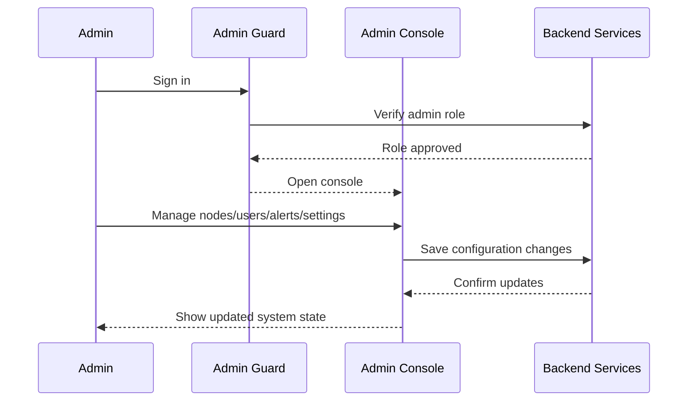

# Admin Console - Simplified Diagram

```mermaid
sequenceDiagram
  participant Admin
  participant Guard as Admin Guard
  participant Console as Admin Console
  participant Backend as Backend Services

  Admin->>Guard: Sign in
  Guard->>Backend: Verify admin role
  Backend-->>Guard: Role approved
  Guard-->>Console: Open console

  Admin->>Console: Manage nodes/users/alerts/settings
  Console->>Backend: Save configuration changes
  Backend-->>Console: Confirm updates
  Console-->>Admin: Show updated system state
```
