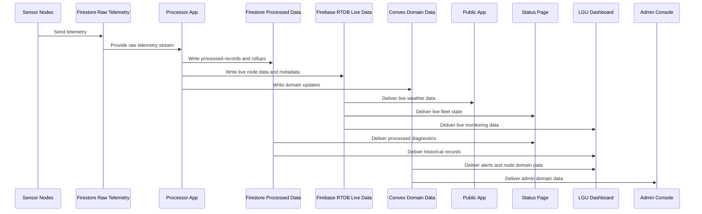

# Full Data Architecture - Simplified

```mermaid
sequenceDiagram
  participant Sensor as Sensor Nodes
  participant FSRaw as Firestore Raw Telemetry
  participant Processor as Processor App
  participant FSProc as Firestore Processed Data
  participant RTDB as Firebase RTDB Live Data
  participant Convex as Convex Domain Data
  participant Public as Public App
  participant Status as Status Page
  participant LGU as LGU Dashboard
  participant Admin as Admin Console

  Sensor->>FSRaw: Send telemetry
  FSRaw->>Processor: Provide raw telemetry stream
  Processor->>FSProc: Write processed records and rollups
  Processor->>RTDB: Write live node data and metadata
  Processor->>Convex: Write domain updates

  RTDB->>Public: Deliver live weather data
  RTDB->>Status: Deliver live fleet state
  RTDB->>LGU: Deliver live monitoring data

  FSProc->>Status: Deliver processed diagnostics
  FSProc->>LGU: Deliver historical records

  Convex->>LGU: Deliver alerts and node domain data
  Convex->>Admin: Deliver admin domain data
```
