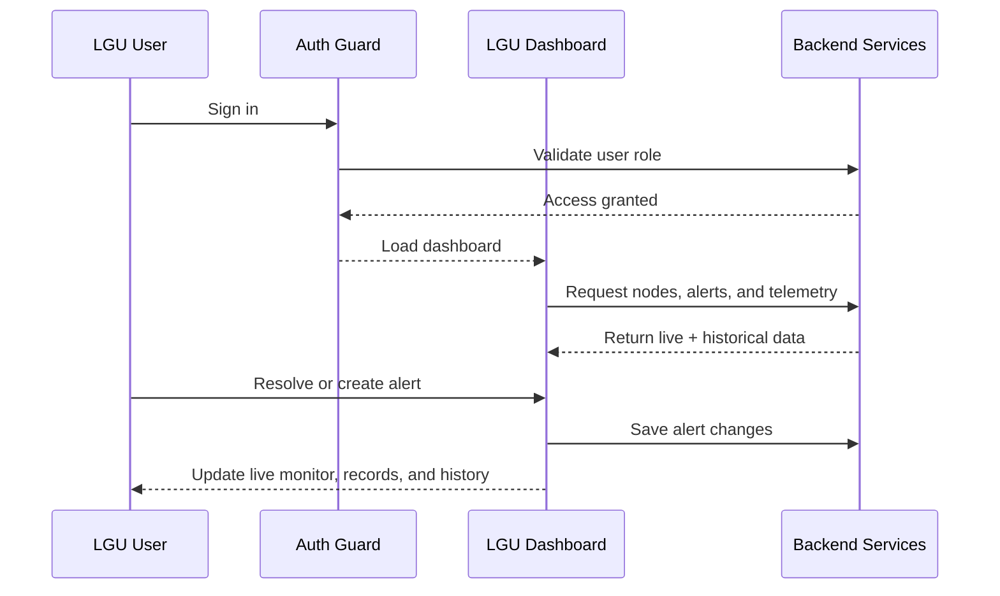

# LGU Dashboard - Simplified Diagram

```mermaid
sequenceDiagram
  participant LGU as LGU User
  participant Auth as Auth Guard
  participant Dashboard as LGU Dashboard
  participant Backend as Backend Services

  LGU->>Auth: Sign in
  Auth->>Backend: Validate user role
  Backend-->>Auth: Access granted
  Auth-->>Dashboard: Load dashboard

  Dashboard->>Backend: Request nodes, alerts, and telemetry
  Backend-->>Dashboard: Return live + historical data
  LGU->>Dashboard: Resolve or create alert
  Dashboard->>Backend: Save alert changes
  Dashboard-->>LGU: Update live monitor, records, and history
```
