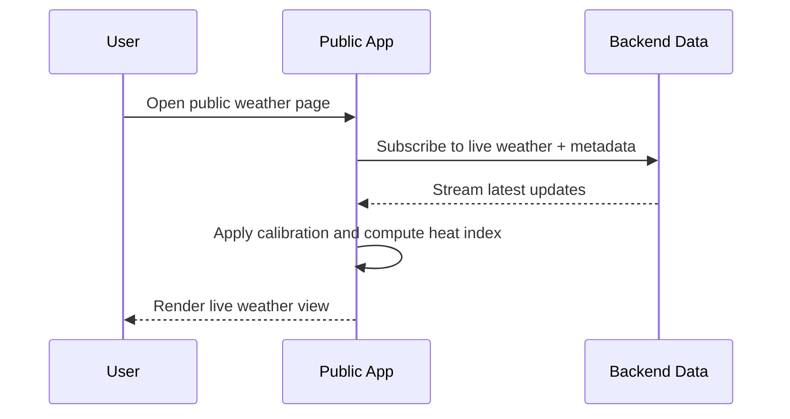

# Public App - Simplified Diagram

```mermaid
sequenceDiagram
  participant User
  participant PublicApp as Public App
  participant Backend as Backend Data

  User->>PublicApp: Open public weather page
  PublicApp->>Backend: Subscribe to live weather + metadata
  Backend-->>PublicApp: Stream latest updates
  PublicApp->>PublicApp: Apply calibration and compute heat index
  PublicApp-->>User: Render live weather view
```
