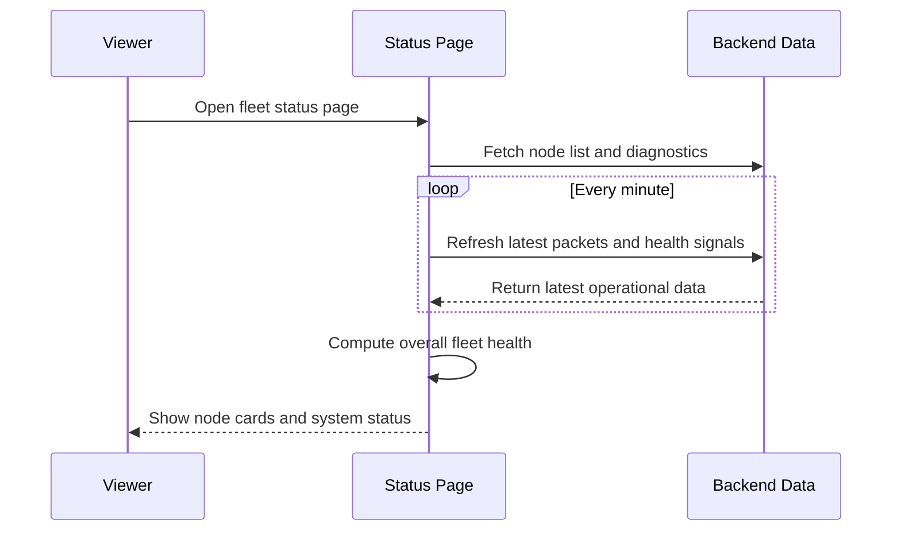

# Status Page - Simplified Diagram

```mermaid
sequenceDiagram
  participant Viewer
  participant StatusPage as Status Page
  participant Backend as Backend Data

  Viewer->>StatusPage: Open fleet status page
  StatusPage->>Backend: Fetch node list and diagnostics
  loop Every minute
    StatusPage->>Backend: Refresh latest packets and health signals
    Backend-->>StatusPage: Return latest operational data
  end
  StatusPage->>StatusPage: Compute overall fleet health
  StatusPage-->>Viewer: Show node cards and system status
```
