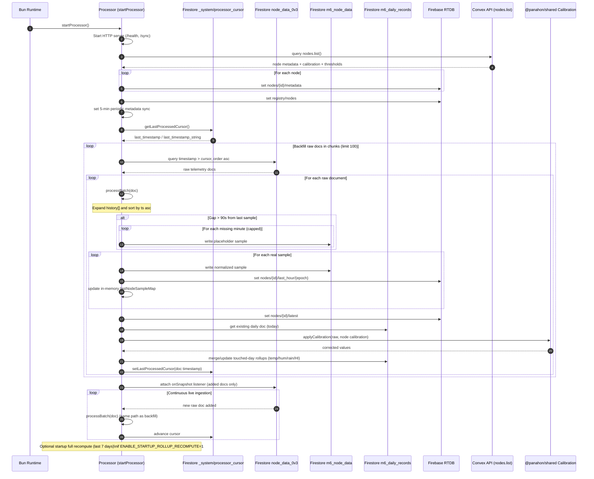

# Processor App Sequence Diagram

This diagram describes the full runtime flow of the Processor app.

```mermaid
sequenceDiagram
    autonumber
    participant Boot as Bun Runtime
    participant Proc as Processor (startProcessor)
    participant Sys as Firestore _system/processor_cursor
    participant Raw as Firestore node_data_0v3
    participant Norm as Firestore m6_node_data
    participant Daily as Firestore m6_daily_records
    participant RTDB as Firebase RTDB
    participant Convex as Convex API (nodes.list)
    participant Shared as @panahon/shared Calibration

    Boot->>Proc: startProcessor()

    Proc->>Proc: Start HTTP server (/health, /sync)
    Proc->>Convex: query nodes.list()
    Convex-->>Proc: node metadata + calibration + thresholds
    loop For each node
        Proc->>RTDB: set nodes/{id}/metadata
    end
    Proc->>RTDB: set registry/nodes
    Proc->>Proc: set 5-min periodic metadata sync

    Proc->>Sys: getLastProcessedCursor()
    Sys-->>Proc: last_timestamp / last_timestamp_string

    loop Backfill raw docs in chunks (limit 100)
        Proc->>Raw: query timestamp > cursor, order asc
        Raw-->>Proc: raw telemetry docs

        loop For each raw document
            Proc->>Proc: processBatch(doc)

            Note over Proc: Expand history[] and sort by ts asc
            alt Gap > 90s from last sample
                loop For each missing minute (capped)
                    Proc->>Norm: write placeholder sample
                end
            end

            loop For each real sample
                Proc->>Norm: write normalized sample
                Proc->>RTDB: set nodes/{id}/last_hour/{epoch}
                Proc->>Proc: update in-memory lastNodeSampleMap
            end

            Proc->>RTDB: set nodes/{id}/latest
            Proc->>Daily: get existing daily doc (today)
            Proc->>Shared: applyCalibration(raw, node calibration)
            Shared-->>Proc: corrected values
            Proc->>Daily: merge/update touched-day rollups (temp/hum/rain/HI)

            Proc->>Sys: setLastProcessedCursor(doc timestamp)
        end
    end

    Proc->>Raw: attach onSnapshot listener (added docs only)
    loop Continuous live ingestion
        Raw-->>Proc: new raw doc added
        Proc->>Proc: processBatch(doc) (same path as backfill)
        Proc->>Sys: advance cursor
    end

    Note over Proc: Optional startup full recompute (last 7 days)\nif ENABLE_STARTUP_ROLLUP_RECOMPUTE=1
```
