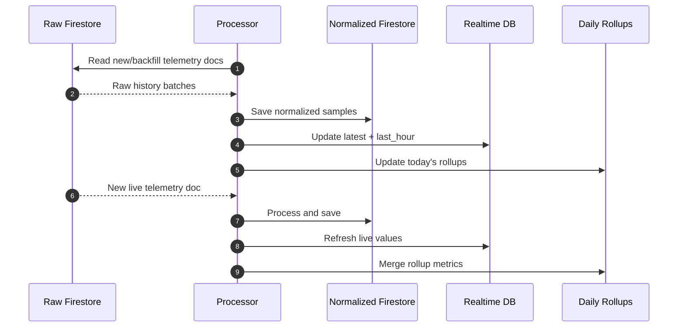

# Processor App Sequence Diagram (Simple)

This is a simplified view of the Processor flow.

```mermaid
sequenceDiagram
    autonumber
    participant Raw as Raw Firestore
    participant Proc as Processor
    participant Norm as Normalized Firestore
    participant RTDB as Realtime DB
    participant Daily as Daily Rollups

    Proc->>Raw: Read new/backfill telemetry docs
    Raw-->>Proc: Raw history batches

    Proc->>Norm: Save normalized samples
    Proc->>RTDB: Update latest + last_hour
    Proc->>Daily: Update today's rollups

    Raw-->>Proc: New live telemetry doc
    Proc->>Norm: Process and save
    Proc->>RTDB: Refresh live values
    Proc->>Daily: Merge rollup metrics
```
